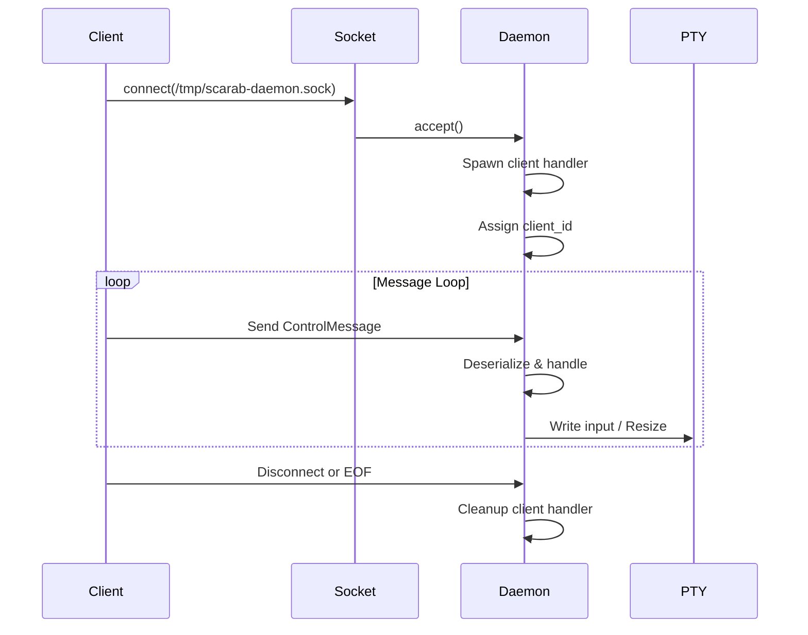

# Scarab IPC Protocol Specification

## Overview

The Scarab IPC (Inter-Process Communication) protocol enables bidirectional communication between the Scarab daemon and client(s) using Unix Domain Sockets on macOS/Linux and Named Pipes on Windows (future).

## Architecture

```
┌──────────────┐         Unix Socket          ┌─────────────────┐
│              │◄──────────────────────────────┤                 │
│   Client 1   │   ControlMessage (rkyv)      │                 │
│   (Bevy)     ├──────────────────────────────►│     Daemon      │
└──────────────┘                               │                 │
                                               │   ┌──────────┐  │
┌──────────────┐                               │   │   PTY    │  │
│              │◄──────────────────────────────┤   └──────────┘  │
│   Client 2   │                               │                 │
│   (Bevy)     ├──────────────────────────────►│   Shared Mem    │
└──────────────┘                               └─────────────────┘
```

## Transport Layer

### Unix Domain Socket
- **Path**: `/tmp/scarab-daemon.sock`
- **Permissions**: 700 (owner only)
- **Max Clients**: 16 concurrent connections
- **Protocol**: Length-prefixed messages

### Message Format

```
┌─────────────┬──────────────────┐
│   Length    │     Payload      │
│  (4 bytes)  │   (rkyv bytes)   │
│   u32 BE    │  ControlMessage  │
└─────────────┴──────────────────┘
```

1. **Length prefix**: 4-byte big-endian u32 indicating payload size
2. **Payload**: rkyv-serialized ControlMessage (zero-copy deserialization)

### Maximum Message Size
- **MAX_MESSAGE_SIZE**: 8192 bytes
- Messages exceeding this limit are rejected

## Message Types

### ControlMessage Enum

```rust
#[derive(Debug, Clone, rkyv::Archive, rkyv::Serialize, rkyv::Deserialize)]
#[archive(check_bytes)]
pub enum ControlMessage {
    Resize { cols: u16, rows: u16 },
    Input { data: Vec<u8> },
    LoadPlugin { path: String },
    Ping { timestamp: u64 },
    Disconnect { client_id: u64 },
}
```

### 1. Resize
**Direction**: Client → Daemon

Notifies daemon of terminal window size change. Daemon updates PTY dimensions.

**Fields**:
- `cols`: Number of character columns (typically 80-200)
- `rows`: Number of character rows (typically 24-60)

**Example**:
```rust
ControlMessage::Resize { cols: 120, rows: 40 }
```

### 2. Input
**Direction**: Client → Daemon

Forwards keyboard/mouse input to PTY.

**Fields**:
- `data`: Raw input bytes (UTF-8 text, ANSI escape sequences, etc.)

**Size Limit**: Must not exceed MAX_MESSAGE_SIZE

**Example**:
```rust
// Regular character
ControlMessage::Input { data: vec![b'a'] }

// Enter key
ControlMessage::Input { data: vec![b'\r'] }

// Arrow Up (ANSI escape sequence)
ControlMessage::Input { data: vec![0x1B, b'[', b'A'] }
```

### 3. LoadPlugin
**Direction**: Client → Daemon

Requests loading of a Fusabi plugin.

**Fields**:
- `path`: Filesystem path to plugin WASM file

**Example**:
```rust
ControlMessage::LoadPlugin {
    path: "/usr/local/share/scarab/plugins/fzf.wasm".to_string()
}
```

### 4. Ping
**Direction**: Client → Daemon

Heartbeat message for connection liveness checking.

**Fields**:
- `timestamp`: Unix timestamp in milliseconds

**Example**:
```rust
ControlMessage::Ping {
    timestamp: SystemTime::now()
        .duration_since(UNIX_EPOCH)
        .unwrap()
        .as_millis() as u64
}
```

### 5. Disconnect
**Direction**: Client → Daemon

Graceful disconnection notification.

**Fields**:
- `client_id`: Unique client identifier

**Example**:
```rust
ControlMessage::Disconnect { client_id: 42 }
```

## Connection Lifecycle

### Client Connection Flow



### Reconnection Strategy

Clients implement exponential backoff on connection failures:

1. Initial delay: 100ms
2. Max delay: 5000ms (5 seconds)
3. Max attempts: 10
4. Backoff multiplier: 2x

**Formula**: `delay = min(initial_delay * 2^attempt, max_delay)`

## Error Handling

### Client-Side Errors
- **Connection Failed**: Retry with exponential backoff
- **Write Failed**: Mark connection dead, attempt reconnection
- **Serialization Failed**: Log error, skip message

### Daemon-Side Errors
- **Deserialization Failed**: Log error, continue reading
- **PTY Write Failed**: Log error, client stays connected
- **Invalid Message Size**: Close client connection

### Graceful Degradation
- Clients can operate in read-only mode (shared memory) if IPC fails
- Daemon continues serving other clients if one client crashes
- Socket cleanup on daemon shutdown

## Performance Characteristics

### Latency Targets
- **Message Roundtrip**: <1ms (median)
- **P99 Latency**: <5ms
- **Throughput**: 10,000+ messages/second per client

### Concurrency
- **Max Concurrent Clients**: 16
- **Message Queue Depth**: 32 per client
- **Thread Pool**: 2 Tokio worker threads

### Zero-Copy Optimization
- rkyv serialization enables zero-copy deserialization
- Shared memory used for bulk data (terminal grid)
- IPC used only for control messages (low volume)

## Security Considerations

### File Permissions
Unix socket created with 700 permissions (owner read/write/execute only).

### Input Validation
- Message length validated before allocation
- UTF-8 validation skipped (raw PTY input)
- Path validation for LoadPlugin (future)

### Rate Limiting
Not currently implemented. Future versions may add:
- Per-client message rate limits
- Input data size limits
- Connection attempt rate limits

### DOS Protection
- Maximum message size enforced
- Maximum concurrent clients enforced
- Client timeout detection (future)

## Platform Support

### Current Support
- ✅ macOS: Unix Domain Sockets
- ✅ Linux: Unix Domain Sockets
- ❌ Windows: Named Pipes (planned)

### Windows Implementation (Future)

```
Path: \\.\pipe\scarab-daemon
API: tokio::net::windows::named_pipe
```

## Testing

### Integration Tests
Located in `scarab-daemon/tests/ipc_integration.rs`

Key test scenarios:
1. Single client connection
2. Multiple concurrent clients
3. Message serialization/deserialization
4. Resize event handling
5. Input forwarding
6. Graceful disconnection
7. Reconnection logic
8. Latency benchmarks
9. Stress testing (1000+ messages)

### Running Tests
```bash
# Start daemon in separate terminal
cargo run --bin scarab-daemon

# Run integration tests
cargo test --test ipc_integration -- --test-threads=1

# Run with logging
RUST_LOG=debug cargo test --test ipc_integration -- --test-threads=1 --nocapture
```

## Future Enhancements

### Protocol V2 (Planned)
- [ ] Bidirectional messaging (daemon → client notifications)
- [ ] Compression for large messages
- [ ] Encryption for sensitive data
- [ ] Authentication/authorization
- [ ] Protocol versioning/negotiation

### Features
- [ ] Plugin API via IPC
- [ ] Configuration updates via IPC
- [ ] Session management commands
- [ ] Statistics/metrics queries
- [ ] Remote debugging protocol

## References

- [Tokio Unix Sockets](https://tokio.rs/tokio/tutorial/io)
- [rkyv Zero-Copy Serialization](https://rkyv.org/)
- [PTY Resizing](https://man7.org/linux/man-pages/man4/pty.4.html)
- [Unix Domain Socket Security](https://man7.org/linux/man-pages/man7/unix.7.html)

## Changelog

### v0.1.0 (2025-11-21)
- Initial IPC implementation
- Unix Domain Socket support
- rkyv serialization
- Multi-client support
- Reconnection logic
- Resize and input forwarding
