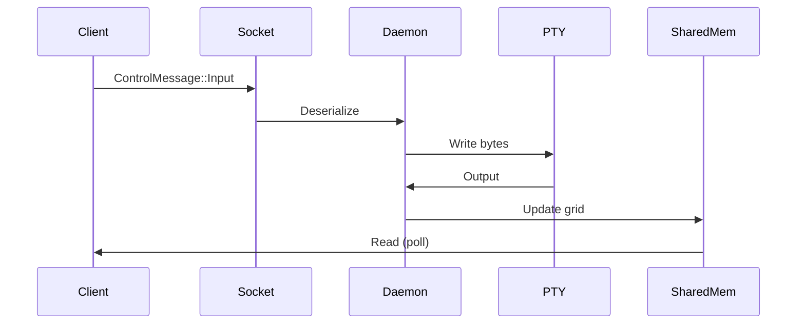

# Issue #3: IPC Control Channel

**Phase**: 1C - Core Terminal Emulation
**Priority**: 🟡 High
**Workstream**: Systems/IPC
**Estimated Effort**: 1 week
**Assignee**: Systems/IPC Specialist Agent

---

## 🎯 Objective

Implement a Unix Domain Socket (macOS/Linux) and Named Pipes (Windows) for control messages between client and daemon, enabling resize, input forwarding, and multi-client support.

---

## 📋 Background

Currently, only shared memory is used for bulk data. We need a control channel for:
- Window resize events (client → daemon)
- Keyboard/mouse input (client → daemon)
- Client discovery and attachment
- Configuration updates
- Plugin commands

---

## ✅ Acceptance Criteria

- [ ] Unix Domain Socket server in daemon
- [ ] Client connects on startup
- [ ] Serialize ControlMessage with rkyv
- [ ] Handle Resize events (update PTY size)
- [ ] Forward keyboard input to PTY
- [ ] Support multiple concurrent clients
- [ ] Handle client disconnect gracefully
- [ ] Async I/O with Tokio
- [ ] Error recovery (reconnection logic)
- [ ] Named Pipes for Windows support

---

## 🔧 Technical Approach

### Step 1: Socket Server (daemon/src/ipc.rs)
```rust
use tokio::net::{UnixListener, UnixStream};
use scarab_protocol::ControlMessage;

pub async fn start_ipc_server() -> Result<()> {
    let socket_path = "/tmp/scarab-daemon.sock";
    let listener = UnixListener::bind(socket_path)?;

    loop {
        let (stream, _) = listener.accept().await?;
        tokio::spawn(handle_client(stream));
    }
}

async fn handle_client(mut stream: UnixStream) -> Result<()> {
    let mut buf = [0u8; 4096];

    loop {
        let n = stream.read(&mut buf).await?;
        if n == 0 { break; } // Client disconnected

        let msg: ControlMessage = rkyv::from_bytes(&buf[..n])?;
        handle_message(msg).await?;
    }

    Ok(())
}
```

### Step 2: Client Connection (client/src/ipc.rs)
```rust
use tokio::net::UnixStream;

#[derive(Resource)]
struct IpcChannel {
    stream: UnixStream,
}

impl IpcChannel {
    async fn send(&mut self, msg: ControlMessage) -> Result<()> {
        let bytes = rkyv::to_bytes::<_, 4096>(&msg)?;
        self.stream.write_all(&bytes).await?;
        Ok(())
    }
}
```

### Step 3: Message Handlers
```rust
async fn handle_message(msg: ControlMessage) -> Result<()> {
    match msg {
        ControlMessage::Resize { cols, rows } => {
            // Resize PTY
            pty.resize(PtySize { cols, rows, .. })?;
        }
        ControlMessage::Input { data } => {
            // Forward to PTY
            pty_writer.write_all(&data)?;
        }
        ControlMessage::LoadPlugin { path } => {
            // Load plugin from path
        }
    }
    Ok(())
}
```

### Step 4: Input Forwarding (client)
```rust
fn handle_input(
    keys: Res<ButtonInput<KeyCode>>,
    mut ipc: ResMut<IpcChannel>,
) {
    for key in keys.get_just_pressed() {
        let bytes = key_to_bytes(*key);
        ipc.send(ControlMessage::Input { data: bytes }).await?;
    }
}
```

---

## 📦 Deliverables

1. **Code**: `scarab-daemon/src/ipc.rs` and `scarab-client/src/ipc.rs`
2. **Protocol**: Extended ControlMessage variants
3. **Tests**: Integration tests for message passing
4. **Documentation**: IPC protocol specification
5. **Examples**: Multi-client demo

---

## 🔗 Dependencies

- **Depends On**: None (independent workstream)
- **Blocks**: Issue #7 (Session Management) - needs multi-client support

---

## 📚 Resources

- [Tokio Unix Sockets](https://tokio.rs/tokio/tutorial/io#unix-sockets)
- [rkyv Serialization](https://rkyv.org/cookbook.html)
- [PTY Resizing](https://man7.org/linux/man-pages/man4/pty.4.html)
- [Windows Named Pipes](https://docs.microsoft.com/en-us/windows/win32/ipc/named-pipes)

---

## 🎯 Success Metrics

- ✅ <1ms message roundtrip latency
- ✅ Support 10+ concurrent clients
- ✅ No message loss during heavy load
- ✅ Graceful degradation on disconnects
- ✅ Zero-copy message passing where possible

---

## 💡 Implementation Notes

### Error Handling
- Reconnection with exponential backoff
- Buffer overflow protection
- Client timeout detection
- Zombie client cleanup

### Security Considerations
- File permissions on Unix socket (700)
- Client authentication (optional)
- Rate limiting on commands
- Input validation/sanitization

### Platform Differences
- **macOS/Linux**: Unix Domain Sockets at `/tmp/scarab-daemon.sock`
- **Windows**: Named Pipe at `\\.\pipe\scarab-daemon`
- Abstract namespace sockets on Linux (optional)

---

## 🐛 Known Issues

- Need to handle SIGPIPE on broken connections
- Socket cleanup on daemon crash
- Multiple daemons on same machine (port conflicts)

---

## 🔄 Message Flow



---

**Created**: 2025-11-21
**Labels**: `phase-1`, `high-priority`, `ipc`, `systems`, `tokio`
